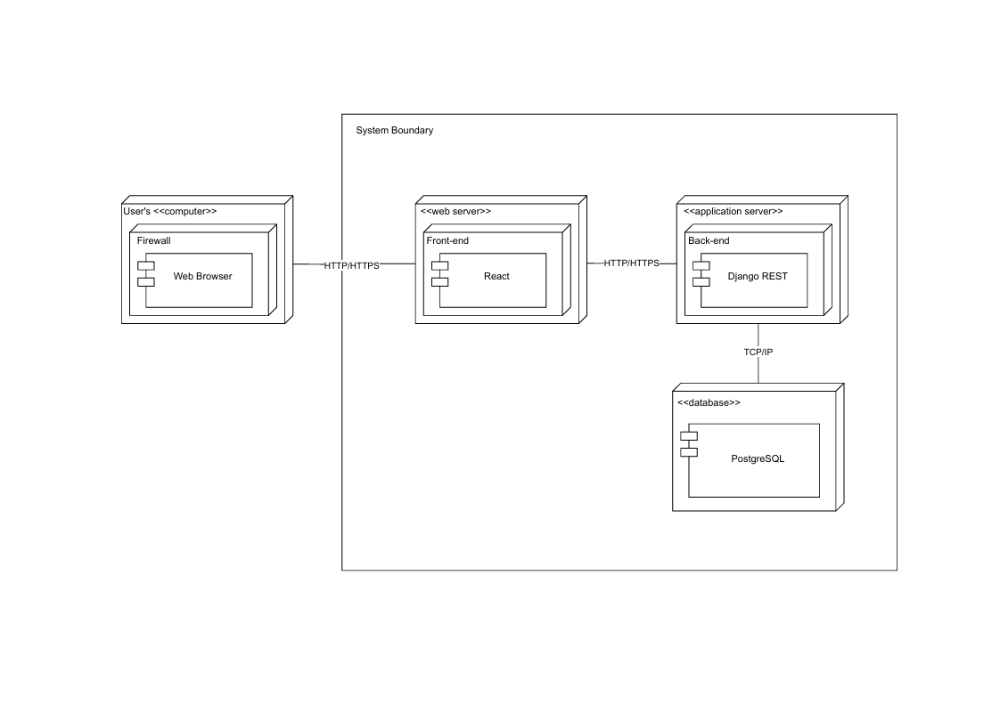

# Diagrama de Implementação

## **Introdução**

Um diagrama de implementação (deployment diagram) é um diagrama de estrutura da UML que representa a arquitetura física de um sistema, mostrando como artefatos de software são distribuídos (implantados) em nós de execução ou dispositivos de hardware. Nele, artefatos são ligados a nós (nodes), que podem ser tanto dispositivos físicos quanto ambientes de execução de software, e esses nós podem estar interconectados por caminhos de comunicação, refletindo a topologia da rede do sistema

## **Metodologia**

O diagrama de implantação foi elaborado colaborativamente em uma reunião síncrona realizada via Microsoft Teams, contando com a participação de todos os integrantes responsáveis pelo projeto. Durante o encontro, discutimos os requisitos de hardware e software, definimos os nós de execução e as conexões de rede necessárias, além de atribuir quais artefatos seriam implantados em cada ambiente.

Para a modelagem visual, utilizamos a ferramenta Draw.io, aproveitando sua interface intuitiva e recursos de diagramação flexível para representar corretamente nós, artefatos e caminhos de comunicação. A construção do diagrama seguiu as orientações e materiais de referência fornecidos pela professora Milene Serrano, que disponibilizou exemplos de deployment diagrams e boas práticas de UML para garantir a consistência e aderência aos padrões da Linguagem de Modelagem Unificada.

## **Tabela de Participação na Produção do Artefato**

| 
Nome do Integrante                       | 
Artefato          | 
Descrição da Contribuição                                                                                                                            | 
Análise Crítica                                                                                                                                                                                                                                                                                                                                                                                                                                                                                                                                                              | 
Link Comprobatório                          |
| --------------------------------------------------- | ------------------------- | --------------------------------------------------------------------------------------------------------------------------------------------------------------- | ------------------------------------------------------------------------------------------------------------------------------------------------------------------------------------------------------------------------------------------------------------------------------------------------------------------------------------------------------------------------------------------------------------------------------------------------------------------------------------------------------------------------------------------------------------------------------------ | --------------------------------------------------- |
| [Arthur Fonseca](https://github.com/arthurfonsecaa) | Diagrama de Implementação | Participei ativamente da criação do diagrama de implantação, colaborando na modelagem, e fui responsável pela documentação completa do artefato no repositório. | Ao elaborar o diagrama de implantação, constatei na prática como a UML permite representar a arquitetura física de um sistema, mapeando claramente nós, artefatos e conexões de rede, o que me ajudou a identificar dependências, prever pontos de falha e entender melhor como os componentes de software são distribuídos entre ambientes distintos, reforçando a importância de uma documentação visual precisa para facilitar a comunicação e a implantação eficiente.                                                                                                           | [Ata 04](/docs/Projeto/IniciativasExtras/ata_04.md) |
| [Letícia Hladczuk](https://github.com/HladczukLe)   | Diagrama de Implementação | Na modelagem do diagrama de implantação, participei ativamente da definição e representação dos principais artefatos do sistema.                                | Modelar o diagrama de implantação foi uma experiência valiosa para entender como os artefatos de software são distribuídos e organizados na prática. A visualização dos componentes e suas interações me ajudou a identificar pontos de acoplamento forte e a propor melhorias. Também percebi o quanto esse diagrama é útil para orientar a configuração do ambiente de desenvolvimento e as estratégias de build e deploy. Ele serve como um elo entre o design e a infraestrutura real do sistema.                                                                                | [Ata 04](/docs/Projeto/IniciativasExtras/ata_04.md) |
| [Fillipe Souto](https://github.com/fillipeb50)      | Diagrama de Implementação | Participei ativamente da criação do diagrama de implementação e auxiliando na modelagem junto com o Arthur e a Letícia.                                         | Participar da criação do diagrama de implementação me ajudou a entender melhor como os componentes do sistema são organizados na prática, além de como o software é realmente distribuído entre front-end e back-end. Pude perceber a importância de representar visualmente a estrutura do projeto, pois isso facilita a comunicação entre a equipe, a manutenção do sistema e o planejamento de novas funcionalidades. Essa etapa também me ajudou a consolidar conhecimentos sobre arquitetura de software e sobre como as partes do sistema se conectam no ambiente de execução. | [Ata 04](/docs/Projeto/IniciativasExtras/ata_04.md) |

## **Resultados**

**Diagrama de Implementação:**

**Autor(es):** [Arthur Fonseca](https://github.com/arthurfonsecaa), [Letícia Hladczuk](https://github.com/HladczukLe) e [Fillipe Souto](https://github.com/fillipeb50).

## **Gravação da Produção do Artefato**

**Gravação da produção do Diagrama de Implementação:**

<iframe width="560" height="315" src="https://www.youtube.com/embed/_y-wE9jpPBs?si=qogJfaVaIkssP7Zm" title="YouTube video player" frameborder="0" allow="accelerometer; autoplay; clipboard-write; encrypted-media; gyroscope; picture-in-picture; web-share" referrerpolicy="strict-origin-when-cross-origin" allowfullscreen></iframe>

## **Referências Bibliográficas**

> FAKHROUTDINOV, Kirill. Deployment diagrams overview. UML‑diagrams.org, 2009‑2025. Disponível em: https://www.uml-diagrams.org/deployment-diagrams-overview.html. Acesso em: 02 maio 2025.

> PAIVA, Severino. CURSO DE UML – DIAGRAMA DE IMPLANTAÇÃO [vídeo online]. YouTube, 2021. Disponível em: https://www.youtube.com/watch?v=DgERD0HgggQ&t=2s. Acesso em: 02 maio 2025.

## **Histórico de versões**

| Versão | Data       | Descrição                                                       | Autor                                               | Revisor |
| ------ | ---------- | --------------------------------------------------------------- | --------------------------------------------------- | ------- |
| `1.0`  | 02/05/2004 | Criação da documentação do artefato "Diagrama de Implementação" | [Arthur Fonseca](https://github.com/arthurfonsecaa) |     |
