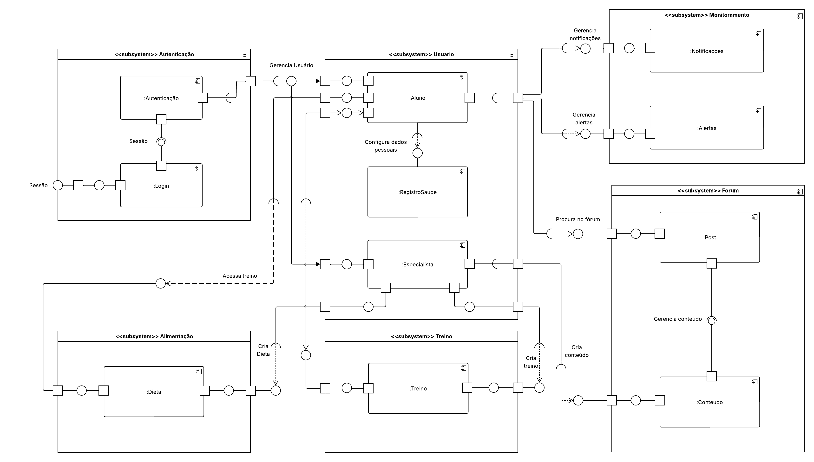

# Diagrama de Componentes

## **Introdução**

O **diagrama de componentes** é um dos diagramas estruturais da **Unified Modeling Language**, popularmente conhecida pela sigla **UML**, e tem como objetivo representar a organização e a dependência entre os componentes de um sistema de software.

O **diagrama de componentes** é utilizado para modelar a estrutura física de um sistema de software, com o intuito de mostrar como o sistema é dividido em **componentes modulares** e como ocorre a comunicação entre esses componentes. Um componente pode ser entendido como uma parte substituível e reutilizável do sistema, como um módulo, subsistema, biblioteca e/ou serviço.

## **Metodologia**

As responsabilidades para a construção do diagrama de componentes foram divididas de forma coletiva pelos integrantes Lucas, Luiza, Mateus e Gabriel por uma reunião via Microsoft Teams. Durante o encontro, foi definido que os subsistemas de autenticação e treinos ficariam com a dupla Mateus e Gabriel, e os subsistemas de saúde e bem-estar ficariam com a dupla Lucas e Luiza, com a integração de todos os subsistemas sendo realizada posteriormente pela dupla Lucas e Luiza.

Para a modelagem do diagrama de componentes, o Lucidchart foi utilizado, aproveitando de sua interface intuitiva e recursos de diagramação flexíveis no formato UML, a fim de representar corretamente todos os subsistemas, interfaces, portas, dependências, dentre outros recursos que tocam o diagrama de componentes.

## **Tabela de Participação na Produção do Artefato**

| 
Nome do Integrante    | 
Artefato| 
Descrição da Contribuição | 
Análise Crítica   | 
Link Comprobatório |
| --- | ---- | --------- | ----| -------------------------- |
| [Luiza Maluf]()  | Diagrama de Componentes| Participei da estruturação e desenvolvimento do fluxo do diagrama de componentes, visando abranger todos os aspectos definidos no escopo mínimo, além disso, garantindo a utilização correta da UML,  | Por ter duas visões diferentes de diagramas, foi interessante trabalhar encima da análise do Mateus e do Gabriel sobre a parte de autenticação e o subsitema de usuário, algo que complementou efetivamente os subsistemas que desenvolvemos.  | [Ata 08](../Projeto/IniciativasExtras/ata_08.md) e [AtA 09](../Projeto/IniciativasExtras/ata_09.md) |
| [Lucas Bottino]() | Diagrama de Componentes | Participei ativamente na elaboração dos subsistemas voltados à saúde e bem-estar, os quais inicialmente  foram concebidos com esse foco, mas posteriormente reorganizados sob os nomes de Usuário, Fórum, Conteúdo e Alimentação, conforme a evolução do projeto. Além disso, contribuí de forma significativa para a integração entre todos os subsistemas do diagrama de componentes, garantindo a coesão e a comunicação adequada entre as partes envolvidas. | Tendo em vista o artefato produzido pelos integrantes  da equipe, considero sua estrutura extremamente relevante,  especialmente no que diz respeito à clareza na separação  de responsabilidades entre os subsistemas,  o que facilita tanto o entendimento quanto a  manutenção do sistema. Além disso, acredito que seria interessante analisar o projeto sob uma perspectiva  orientada a serviços (SOA), o que pode ampliar a visão sobre a escalabilidade e reutilização  dos componentes, proporcionando um  entendimento mais aprofundado do objeto estudado. | [Ata 08](../Projeto/IniciativasExtras/ata_08.md) e [AtA 09](../Projeto/IniciativasExtras/ata_09.md) |
| [Mateus Levy]()  | Diagrama de Caso de Uso | "Eu participei da produção e documentação do artefato."  | "Tendo em vista o artefato produzido pelos integrantes, acredito que ser muito importante no aspecto...., além disso, acredito que uma visão diferente, como..., seja interessante de ser analisada para um melhor entendimento do objeto estudado."    | [Ata 08](../Projeto/IniciativasExtras/ata_08.md) e [AtA 09](../Projeto/IniciativasExtras/ata_09.md) |
| [Gabriel Saraiva Canabrava]()    | Diagrama de Caso de Uso | "Eu participei da produção e documentação do artefato."   | "Tendo em vista o artefato produzido pelos integrantes, acredito que ser muito importante no aspecto...., além disso, acredito que uma visão diferente, como..., seja interessante de ser analisada para um melhor entendimento do objeto estudado."        | [Ata 08](../Projeto/IniciativasExtras/ata_08.md) e [AtA 09](../Projeto/IniciativasExtras/ata_09.md) |

## **Resultados**

**Diagrama de Componentes:**

**Autor(es):** [Lucas Gama De Araujo Bottino](https://github.com/arthurfonsecaa), [Luiza Maluf Amorim](https://github.com/HladczukLe), [Mateus Levy Avelans Boquady](https://github.com/fillipeb50), [Gabriel Saraiva Canabrava](https://github.com/fillipeb50)

## **Gravação da Produção do Artefato**

<iframe width="560" height="315" src="https://www.youtube.com/embed/jAlEcjAqHGM?si=XFO5Eg6x_N37Kp3s " title="YouTube video player" frameborder="0" allow="accelerometer; autoplay; clipboard-write; encrypted-media; gyroscope; picture-in-picture; web-share" referrerpolicy="strict-origin-when-cross-origin" allowfullscreen></iframe>

<iframe width="560" height="315" src="https://www.youtube.com/watch?v=z2-IkMlWWLg" title="YouTube video player" frameborder="0" allow="accelerometer; autoplay; clipboard-write; encrypted-media; gyroscope; picture-in-picture; web-share" referrerpolicy="strict-origin-when-cross-origin" allowfullscreen></iframe>

## **Rastreabilidade**

O Escopo Mínimo e o Diagrama de Classes foram utilizados para auxiliar na construção do Diagrama de Componentes.

- [Escopo Mínimo](https://unbarqdsw2025-1-turma01.github.io/2025.1-T01-_G3_EuMeAmo_Entrega_01/#/Base/1.5.8.Escopo-minimo)
- [Diagrama de Classes](..)

## **Referências Bibliográficas**

> UML DIAGRAMS. Component Diagrams. Disponível em: https://www.uml-diagrams.org/component-diagrams.html. Acesso em: 7 maio 2025.

## **Histórico de versões**

| Versão | Data       | Descrição                                                                                             | Autor                            | Revisor |
| ------ | ---------- | ----------------------------------------------------------------------------------------------------- | -------------------------------- | ------- |
| '1.0'  | 08/05/2025 | Criação da documentação do diagrama de componentes com o padrão de página do projeto                  | [Lucas Gama De Araujo Bottino]() |   [Luiza Maluf]()      |
| '1.1'  | 08/05/2025 | Adicionando introdução, metodologia, resultados, gravações da produção dos artefatos, rastreabilidade | [Lucas Gama De Araujo Bottino]() |  [Luiza Maluf]()       |
