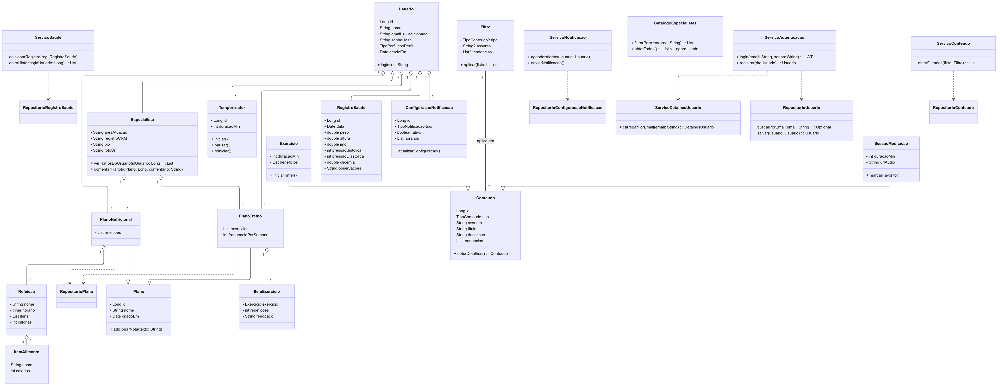
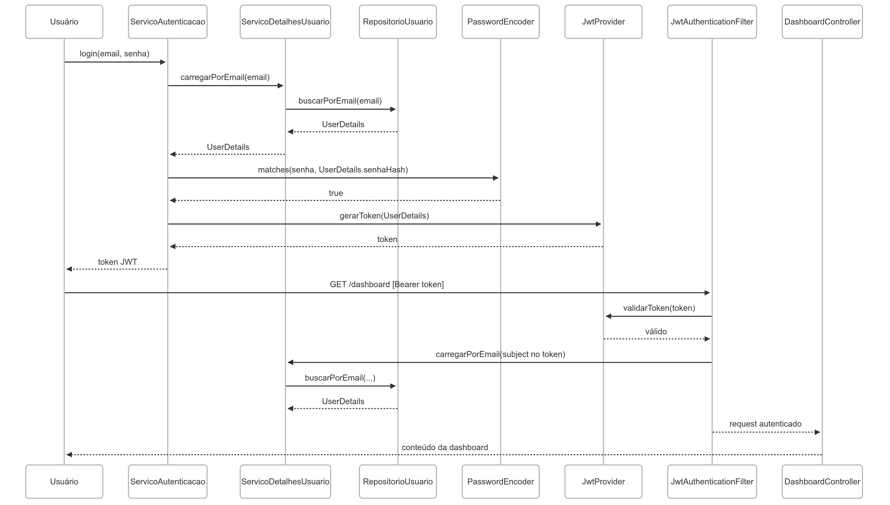

# 2.1. Módulo Notação UML – Modelagem Estática

# Modelagem UML Estática

Este documento reúne os principais diagramas UML estáticos da plataforma de promoção de saúde física, mental e nutricional. A modelagem está dividida em três partes:

- **Diagrama de Classe**  
- **Diagrama de Colaboraçao**  
- **Diagrama de Caso de Uso**  

---

## 1. Diagrama de Classe

O Diagrama de Classe mostra as entidades de domínio, seus atributos, métodos e relacionamentos (herança, associação, composição e dependência). Ele cobre:

- **Usuário** (comum e especialista)  
- **Configuração de Notificações**  
- **Conteúdo** (Exercício, Sessão de Meditação, Filtro)  
- **Planos** (Treino e Nutricional, com itens compostos)  
- **Temporizador**  
- **Registro de Saúde**  
- **Catálogo de Especialistas**  
- **Serviços** (Autenticação, Conteúdo, Saúde, Notificação)  
- **Repositórios JPA**  

## 1. Diagrama de Classe

> 🔍 *Clique na imagem acima para visualizar o diagrama em SVG diretamente.*

## 2. Diagrama de Colaboração

Nesta seção apresentamos o Diagrama de Colaboração (Sequence Diagram) que ilustra, passo a passo, as interações entre os principais componentes do backend durante o processo de autenticação via JWT e o acesso a um endpoint protegido (`/dashboard`). Esse diagrama demonstra como as mensagens fluem entre o usuário, serviços de autenticação, encoder de senha, provedor de token e filtro de segurança, evidenciando a sequência e dependências necessárias para garantir um acesso seguro aos recursos da aplicação.  

## Referências

| Diagrama                | Referência                                   |
|-------------------------|----------------------------------------------|
| Diagrama de Classe      | [https://www.uml-diagrams.org/](https://www.uml-diagrams.org/) |
| Diagrama de Colaboração | [https://www.uml-diagrams.org/](https://www.uml-diagrams.org/) |

