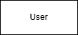
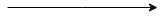
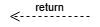
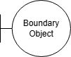
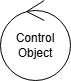
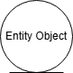

# __Nome do Artefato__

## __Introdução__

O Diagrama de Sequência é um dos diagramas da UML (Unified Modeling Language) utilizado para representar a interação entre os objetos de um sistema ao longo do tempo. Ele mostra, de forma sequencial, como as mensagens são trocadas entre os atores e os objetos envolvidos em um determinado processo ou funcionalidade do sistema. Esse tipo de diagrama é fundamental na fase de modelagem de sistemas orientados a objetos, pois permite visualizar o fluxo de mensagens que garante o funcionamento esperado de um caso de uso específico.

## __Metodologia__

O diagrama de sequência foi desenvolvido de forma colaborativa em uma reunião síncrona realizada via Microsoft Teams, com a participação de todos os integrantes do grupo responsável pelo projeto. Durante o encontro, discutimos os principais casos de uso do sistema **EuMeAmo**, identificamos os atores envolvidos, os componentes que participariam de cada interação e definimos os fluxos de mensagens trocadas entre interface, controladores, serviços e banco de dados.

Para a modelagem visual, utilizamos a ferramenta Draw.io, explorando sua praticidade para criar diagramas de forma organizada e com boa legibilidade. A construção dos diagramas foi orientada pelos conteúdos disponibilizados pela professora Milene Serrano, incluindo exemplos de sequence diagrams e diretrizes de boas práticas em UML, assegurando a consistência da notação e a fidelidade ao comportamento esperado do sistema.

Para a construção dos diagramas, foram utilizados os seguintes elementos:

| Elemento | Descrição | Exemplo |
|--|--|--|
| **Entidades** | Representam uma classe, objetos ou entidades em UML |  |
| **Linhas de Vida** | Um diagrama de sequência é composto por várias dessas notações de linha de vida que devem ser organizadas horizontalmente na parte superior do diagrama. Elas representam os diferentes objetos ou partes que interagem entre si no sistema durante a sequência. |  |
| **Barras de Ativação** | A barra de ativação é a caixa colocada na linha de vida. É usado para indicar que um objeto está ativo (ou instanciado) durante uma interação entre dois objetos. O comprimento do retângulo indica a duração dos objetos que permanecem ativos. |  |
| **Mensagem síncrona** | uma mensagem síncrona é usada quando o remetente espera que o receptor processe a mensagem e retorne antes de continuar com outra mensagem. A ponta de seta usada para indicar este tipo de mensagem é sólida. |  |
| **Mensagem de retorno** | Uma mensagem de retorno é usada para indicar que o receptor da mensagem terminou o processamento da mensagem e está devolvendo o controle para o autor da chamada da mensagem. As mensagens de retorno são peças opcionais de notação, para uma barra de ativação que é acionada por uma mensagem síncrona implica sempre uma mensagem de retorno. |  |
| **Boundary Object (Objeto de Fronteira)** | O objeto de fronteira (boundary) representa a interface entre o sistema e seus usuários ou sistemas externos. Ele é responsável por receber entradas dos atores e exibir saídas, funcionando como uma ponte entre o mundo externo e o sistema. Exemplos comuns incluem telas, formulários e interfaces de APIs. |  |
| **Control Object (Objeto de Controle)** | O objeto de controle coordena o fluxo de um caso de uso, centralizando a lógica do processo. Ele orquestra as interações entre os objetos de fronteira e os de entidade, sendo responsável por tomar decisões e aplicar regras de negócio. |  |
| **Entity Object (Objeto de Entitidade)** | O objeto de entidade representa informações do domínio que devem ser armazenadas ou manipuladas pelo sistema. Ele contém dados persistentes e a lógica associada a esses dados, como cálculos, validações ou relações. |  |

## __Tabela de Participação na Produção do Artefato__

| 
Nome do Integrante | 
Artefato | 
Descrição da Contribuição | 
Análise Crítica 
| 
Link Comprobatório 
|
|------------|----------|------------|------------|---------|
|  [Arthur Fonseca Vale](https://github.com/arthurfonsecaa) |Diagrama de Sequência | Dividimos os diagramas de sequência em partes, e cada integrante ficou responsável por trabalhar em alguns casos de uso específicos. Fui responsável por construir o fluxo de várias funcionalidades, definindo os atores envolvidos, o papel da interface, os serviços acionados e as mensagens trocadas entre frontend, backend e banco de dados. Nas partes em que atuei, cuidei da clareza dos passos, do uso correto da notação e da representação fiel da lógica da aplicação. Após finalizar os fluxos individualmente, revisamos todos em conjunto para manter o padrão e a coerência entre eles. | Durante a construção dos diagramas de sequência, aprendi a mapear com precisão cada etapa do fluxo de dados e a importância de deixar explícito o papel de cada componente (Interface, Controller, Service, Banco). Concluí que diagramas desse tipo são fundamentais não só para documentar, mas para validar requisitos e identificar pontos de ineficiência ou duplicação de lógica antes de implementar o código.| [Ata 03](/docs/Projeto/IniciativasExtras/ata_03.md) |
|  [Fillipe Souto de Andrade](https://github.com/fillipeb50)| Diagrama de Sequência | Participei ativamente da criação do diagrama de sequência e auxiliando na modelagem junto com o Arthur e a Letícia.| Ao participar da criação do diagrama de sequência, consegui entender com mais clareza como os elementos do sistema se comunicam entre si durante a execução de uma funcionalidade. Esse tipo de diagrama me ajudou a visualizar a ordem das chamadas e respostas entre os componentes, o que é essencial para garantir que o fluxo esteja correto e bem estruturado. Também percebi que esse tipo de representação facilita a identificação de possíveis problemas ou pontos de melhoria na lógica da aplicação. | [Ata 03](/docs/Projeto/IniciativasExtras/ata_03.md) |
|  [Letícia de Cássia Hladczuk Rodrigues](https://github.com/HladczukLe)| Diagrama de Sequência | Eu participei ativamente da produção, juntamente com o Arthur e o Fillipe, juntos separamos os diagramas em várias partes e cada um foi responsável por construir fluxos específicos. Além disso, fiquei responsável pela documentação do artefato.| A elaboração dos diagramas de sequência foi fundamental para aprofundar meu entendimento sobre a interação entre os componentes do sistema em tempo de execução. Pude perceber a importância de representar de forma clara a ordem das mensagens e o papel de cada elemento envolvido, o que facilita a comunicação dentro da equipe. Além disso, entendi que esse tipo de diagrama é essencial para confirmar se os requisitos funcionais estão sendo atendidos corretamente e para identificar, de forma antecipada, possíveis falhas na integração entre as camadas, evitando retrabalho na fase de implementação. | [Ata 03](/docs/Projeto/IniciativasExtras/ata_03.md) |

## __Resultados__

__Diagrama de Sequência - Login:__

__Autor(es):__ [Arthur Fonseca](https://github.com/arthurfonsecaa), [Letícia Hladczuk](https://github.com/HladczukLe) e [Fillipe Souto](https://github.com/fillipeb50).

__Diagrama de Sequência - Cadastro:__

__Autor(es):__ [Arthur Fonseca](https://github.com/arthurfonsecaa), [Letícia Hladczuk](https://github.com/HladczukLe) e [Fillipe Souto](https://github.com/fillipeb50).

__Diagrama de Sequência - Notificação/Alertas:__

__Autor(es):__ [Arthur Fonseca](https://github.com/arthurfonsecaa), [Letícia Hladczuk](https://github.com/HladczukLe) e [Fillipe Souto](https://github.com/fillipeb50).

__Diagrama de Sequência - Monitoramento:__

__Autor(es):__ [Arthur Fonseca](https://github.com/arthurfonsecaa), [Letícia Hladczuk](https://github.com/HladczukLe) e [Fillipe Souto](https://github.com/fillipeb50).

__Diagrama de Sequência - Cadastro:__

__Autor(es):__ [Arthur Fonseca](https://github.com/arthurfonsecaa), [Letícia Hladczuk](https://github.com/HladczukLe) e [Fillipe Souto](https://github.com/fillipeb50).

__Diagrama de Sequência - Registro de treinos:__

__Autor(es):__ [Arthur Fonseca](https://github.com/arthurfonsecaa), [Letícia Hladczuk](https://github.com/HladczukLe) e [Fillipe Souto](https://github.com/fillipeb50).

__Diagrama de Sequência - Especialista acompanha os treinos:__

__Autor(es):__ [Arthur Fonseca](https://github.com/arthurfonsecaa), [Letícia Hladczuk](https://github.com/HladczukLe) e [Fillipe Souto](https://github.com/fillipeb50).

__Diagrama de Sequência - Contratar Especialista:__

__Autor(es):__ [Arthur Fonseca](https://github.com/arthurfonsecaa), [Letícia Hladczuk](https://github.com/HladczukLe) e [Fillipe Souto](https://github.com/fillipeb50).

__Diagrama de Sequência - Aplicar filtros de conteúdos:__

__Autor(es):__ [Arthur Fonseca](https://github.com/arthurfonsecaa), [Letícia Hladczuk](https://github.com/HladczukLe) e [Fillipe Souto](https://github.com/fillipeb50).

__Diagrama de Sequência - Registro de dados de saúde:__

__Autor(es):__ [Arthur Fonseca](https://github.com/arthurfonsecaa), [Letícia Hladczuk](https://github.com/HladczukLe) e [Fillipe Souto](https://github.com/fillipeb50).

__Diagrama de Sequência - Timer:__

__Autor(es):__ [Arthur Fonseca](https://github.com/arthurfonsecaa), [Letícia Hladczuk](https://github.com/HladczukLe) e [Fillipe Souto](https://github.com/fillipeb50).

## __Gravação da Produção do Artefato__

 Vídeo 1: Produção do Diagrama de Sequência - Modelagem Dinâmica.

<iframe width="560" height="315" src="https://youtu.be/embed/7jzILsLqgAw" title="YouTube video player" frameborder="0" allow="accelerometer; autoplay; clipboard-write; encrypted-media; gyroscope; picture-in-picture; web-share" referrerpolicy="strict-origin-when-cross-origin" allowfullscreen></iframe>

## __Referências Bibliográficas__

> 1. BRASIL. The Club. Diagrama de sequência UML. Disponível em: <http://www.theclub.com.br/restrito/revistas/201308/umld1308.aspx>. Acesso em: 30 de abril de 2025.
>
> 2. ROCHA, Givanaldo. Diagrama de sequência – Engenharia de Software. IFRN. Disponível em: <https://docente.ifrn.edu.br/givanaldorocha/disciplinas/engenharia-de-software-licenciatura-em-informatica/diagrama-de-sequencia>. Acesso em: 30 de abril de 2025.
>
> 3. SERRANO, Milene. **06a - VideoAula - DSW-Modelagem - Sequência**. [Apostila e vídeo]. Plataforma Aprender, 2024. Acesso em: 30 de abril de 2025.

## __Histórico de versões__

| Versão | Data | Descrição | Autor | Revisor |
|--------|------|-----------|-------|---------|
| '1.0'  | 03/05/2025 | Criação do documento | [Letícia Hladczuk]() | [Revisor]()| 