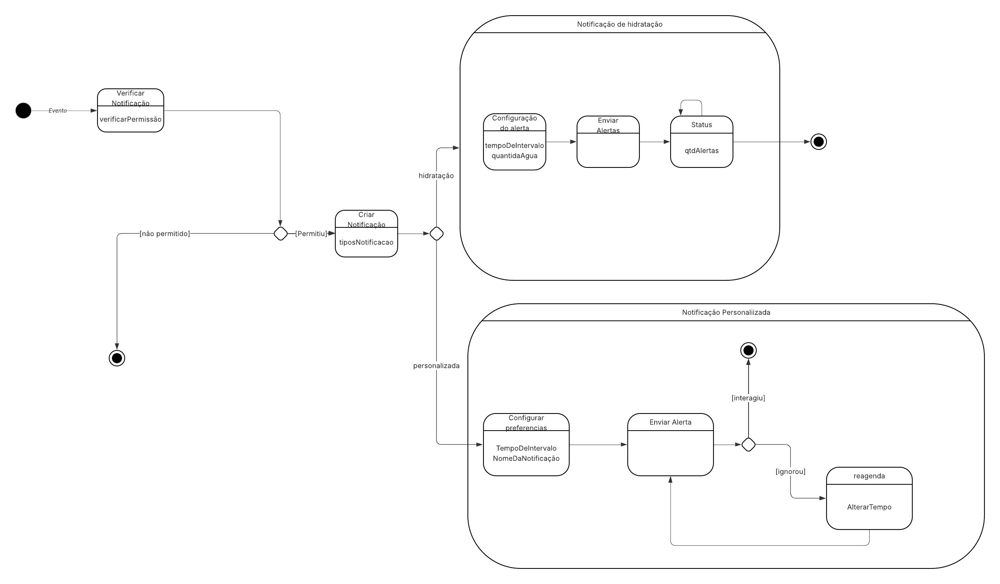
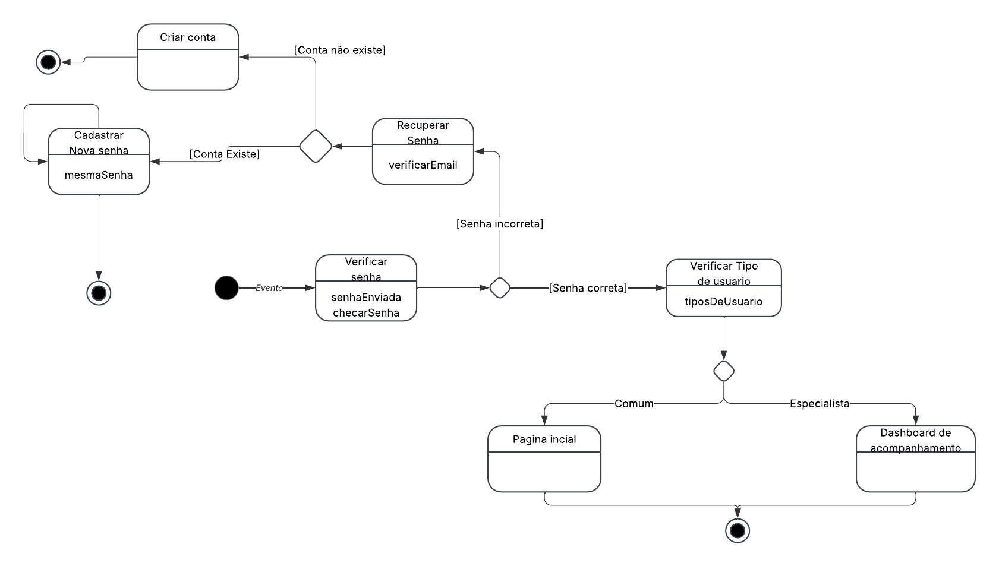

# __Diagrama de estados__

## __Introdução__

O diagrama de estados, também conhecido como diagrama de máquina de estados, é uma ferramenta da engenharia de software usada para modelar o comportamento dinâmico de um sistema ou objeto ao longo do tempo. Ele descreve os diferentes estados que um objeto pode assumir, os eventos que causam mudanças entre esses estados (transições) e as ações associadas a essas mudanças. É especialmente útil para representar sistemas que reagem a eventos externos, como botões pressionados, mudanças de condição ou mensagens recebidas.

## __Metodologia__

Para a criação do diagrama de estados, nosso grupo utilizou a notação UML (Unified Modeling Language) como base para representar os diferentes estados e transições de um sistema. Utilizamos o Lucidchart como ferramenta de apoio, aproveitando seus recursos específicos para modelagem UML, o que facilitou a construção de um diagrama claro e organizado. Essa metodologia permitiu ao grupo representar de forma precisa o comportamento do sistema, destacando os eventos que provocam mudanças de estado e contribuindo para uma melhor compreensão de sua lógica de funcionamento.

## __Tabela de Participação na Produção do Artefato__

| 
Nome do Integrante | 
Artefato | 
Descrição da Contribuição | 
Análise Crítica* | 
Link Comprobatório |
|------------|----------|------------|------------|---------|
|  [Gabriel Saraiva](https://github.com/gabrielsarcan)| Diagrama de Estados | Eu participei da produção e documentação do artefato.| Considerando o artefato produzido pelo grupo, acredito que ele contribui significativamente para a compreensão do comportamento do sistema. Além disso, pensar em estados alternativos ou exceções, como falhas ou condições de erro, pode ampliar a utilidade do diagrama e trazer uma visão mais completa do funcionamento do sistema. | [Ata 05](Projeto/IniciativasExtras/ata_05.md) |
[Mateus Levy](https://github.com/mateus9levy)| Diagrama de Estados | Eu participei da produção e documentação do artefato.| O artefato apresentado pelo grupo oferece uma representação clara e estruturada do comportamento do sistema, facilitando a compreensão de seus fluxos e processos principais. No entanto, a ausência de detalhes sobre a interação entre os subprocessos, como a comunicação entre "Notificação de Hidratação" e "Notificação Personalizada", pode limitar a compreensão do fluxo de dados, tornando o diagrama menos completo para uma análise mais aprofundada do sistema.. | [Ata 05](Projeto/IniciativasExtras/ata_05.md) |

O diagrama desenvolvido apresenta de forma clara os principais fluxos do sistema, contribuindo para a compreensão do seu comportamento. Ainda assim, a inclusão de exceções e cenários alternativos, como erros de login ou falhas no envio de notificações, poderia enriquecer a análise e ampliar a cobertura do modelo.

## __Resultados__

__Diagrama de Estados:  Notificação:__

__Autor(es):__ [Gabriel Saraiva](https://github.com/gabrielsarcan) e [Mateus Levy](https://github.com/mateus9levy).

__Diagrama de Estados:  Login:__

__Autor(es):__ [Gabriel Saraiva](https://github.com/gabrielsarcan) e [Mateus Levy](https://github.com/mateus9levy).

## __Gravação da Produção do Artefato__

<iframe width="560" height="315" src="https://www.youtube.com/embed/jAlEcjAqHGM?si=bVjTAnoXDg0O08hh" title="YouTube video player" frameborder="0" allow="accelerometer; autoplay; clipboard-write; encrypted-media; gyroscope; picture-in-picture; web-share" referrerpolicy="strict-origin-when-cross-origin" allowfullscreen></iframe>

## __Referências Bibliográficas__

> LUCID SOFTWARE. Lucidchart – Diagrama de estados UML. 2025. Disponível em: https://www.lucidchart.com/pages/uml-state-diagram. Acesso em: 6 maio 2025.

## __Histórico de versões__

| Versão | Data | Descrição | Autor | Revisor |
|--------|------|-----------|-------|---------|
| 1.0  | 06/05/2025 | Criação do Documento | [Gabriel Saraiva](https://github.com/gabrielsarcan) e [Mateus Levy](https://github.com/mateus9levy) | [Revisor]()|
