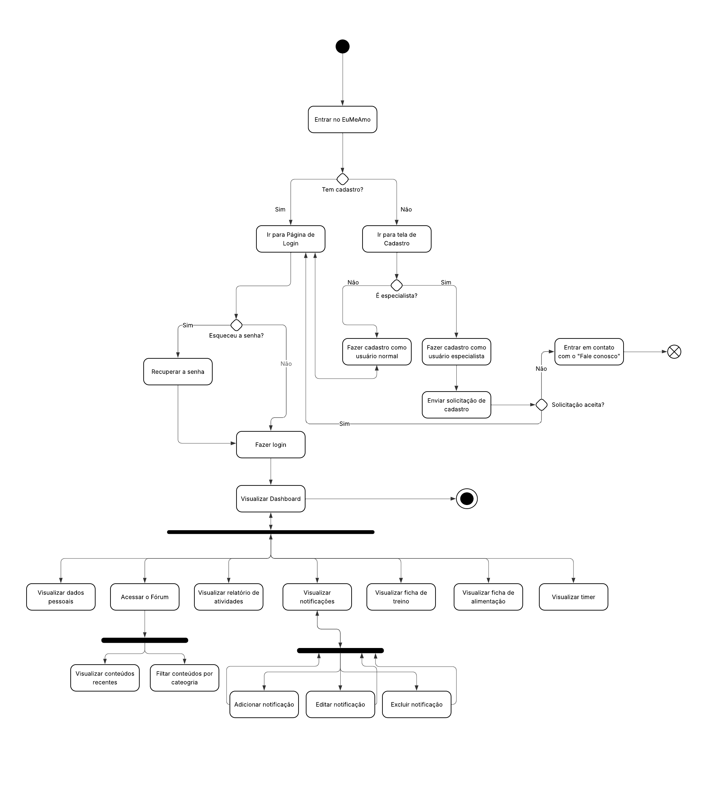

# **Diagrama de Atividades**

## **Introdução**

Este documento apresenta o Diagrama de Atividades do sistema EuMeAMo, desenvolvido para ilustrar o fluxo de ações e decisões dentro de um processo específico do sistema. O diagrama auxilia na compreensão do comportamento do sistema em diferentes cenários e apoia a modelagem dos requisitos funcionais.

## **Metodologia**

O Diagrama de Atividades é uma representação gráfica baseada na UML que modela os fluxos de trabalho de um sistema, incluindo ações, decisões, paralelismos e estados finais. Segundo Pressman (2016), esse diagrama é útil para descrever o comportamento dinâmico de um sistema, particularmente em processos com múltiplos caminhos possíveis. A metodologia adotada seguiu os padrões definidos por Sommerville (2011) e o guia da UML 2.5.

Para sua construção, foram definidos os principais processos do sistema com base nos requisitos identificados previamente. Utilizamos a ferramenta Lucidchart para a modelagem e foram representados: início do processo, ações, decisões, fluxos alternativos e fim. A estrutura base foi derivada dos principais casos de uso previamente modelados.

## **Tabela de Participação na Produção do Artefato**

Cada integrante do grupo será responsável por indicar a sua própria contribuição ao projeto em cada artefato, de forma que a tabela final de participações seja produzida ao longo da construção do projeto.

Nesse sentido, ao participar da produção de um artefato, você deve preencher na tabela as informações a seguir:

| 
Nome do Integrante                                   | 
Artefato       | 
Descrição da Contribuição             | 
Análise Crítica\*                                                                                 | 
Link Comprobatório               |
| --------------------------------------------------------------- | ---------------------- | ------------------------------------------------ | --------------------------------------------------------------------------------------------------------- | ---------------------------------------- |
| [Luiza Maluf Amorim](https://github.com/LuizaMaluf)             | Diagrama de Atividade  | Participei da produção do diagrama de atividades | Participei da produção do diagrama visando mostrar o fluxo de atividades do usuário principal do sistema. | [Ata 08](../Projeto/IniciativasExtras/ata_08.md) e [Ata 09](../Projeto/IniciativasExtras/ata_09.md) |
| [Lucas Gama De Araujo Bottino](https://github.com/bottinolucas) | Diagrama de Atividades | Participou da produção do diagrama.              | Participei da produção do diagrama visando mostrar o fluxo de atividades do usuário principal do sistema. | [Ata 08](../Projeto/IniciativasExtras/ata_08.md) e [Ata 09](../Projeto/IniciativasExtras/ata_09.md)  |

## **Resultados**

## **Gravação da Produção do Artefato**

<iframe width="560" height="315" src="https://www.youtube.com/embed/z2-IkMlWWLg?si=JYyzLSTpLWGdQRr4" title="YouTube video player" frameborder="0" allow="accelerometer; autoplay; clipboard-write; encrypted-media; gyroscope; picture-in-picture; web-share" referrerpolicy="strict-origin-when-cross-origin" allowfullscreen></iframe>

## **Referências Bibliográficas**

> PRESSMAN, R. S. Engenharia de Software. 8. ed. São Paulo: McGraw Hill Brasil, 2016.

> SOMMERVILLE, I. Engenharia de Software. 9. ed. São Paulo: Pearson Prentice Hall, 2011.

## **Histórico de versões**

| Versão | Data       | Descrição             | Autor                                               | Revisor                                                         |
| ------ | ---------- | --------------------- | --------------------------------------------------- | --------------------------------------------------------------- |
| '1.0'  | 09/05/2025 | Criação do documento. | [Luiza Maluf Amorim](https://github.com/LuizaMaluf) | [Lucas Gama De Araujo Bottino](https://github.com/bottinolucas) |
