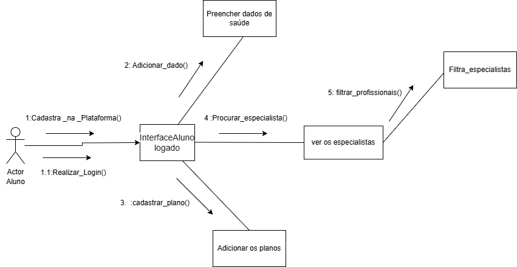

# Diagrama de Colaboração UML

## Introdução

O presente artefato representa um Diagrama de Colaboração UML, também conhecido como Diagrama de Comunicação. Esse diagrama ilustra a interação entre objetos e atores dentro do sistema, destacando a troca de mensagens necessárias para executar uma funcionalidade completa do domínio. Neste caso, é retratado o fluxo de ações que um **Usuário** realiza para filtrar conteúdos, visualizar detalhes, adicionar planos e atualizar seu **Registro de Saúde**.

## Metodologia

O Diagrama de Colaboração é um dos diagramas dinâmicos definidos pela UML (Unified Modeling Language), sendo utilizado para modelar interações entre objetos. Ele representa como os objetos colaboram para executar um processo, enfatizando as mensagens trocadas e os relacionamentos estruturais entre os elementos.

Este tipo de modelagem segue os princípios definidos por Booch, Rumbaugh e Jacobson (1999), e foi desenvolvido com base na metodologia orientada a objetos apresentada por Larman (2005) e Fowler (2003), utilizando ferramentas visuais apropriadas para mapeamento de fluxo, como Visual Paradigm e PlantUML.

> **Referência metodológica:**  
> - Fowler, M. *UML Distilled: A Brief Guide to the Standard Object Modeling Language*, 3ª ed., Addison‑Wesley, 2003.  
> - Larman, C. *Applying UML and Patterns*, 3ª ed., Prentice Hall, 2005.  
> - Booch, G.; Rumbaugh, J.; Jacobson, I. *The Unified Modeling Language User Guide*, Addison‑Wesley, 1999.

| Nome do Integrante  | Artefato                | Descrição da Contribuição                                                                                                                        | Análise Crítica                                                                                                                                                                                                     | Link Comprobatório |
| ------------------- | ----------------------- | ------------------------------------------------------------------------------------------------------------------------------------------------ | ------------------------------------------------------------------------------------------------------------------------------------------------------------------------------------------------------------------- | ------------------ |
| [Carlos Henrique]() | Diagrama de Colaboração | Participei da elaboração do fluxo de mensagens entre os objetos e defini a lógica das condições de interação.                                    | O artefato é útil para visualizar como cada entidade interage, especialmente nos momentos de decisão. Uma melhoria futura pode incluir fluxos alternativos para cenários inválidos, como filtros sem resultado.     | [Ata 10](../Projeto/IniciativasExtras/ata_10.md)         |
| [Pablo Serra]()     | Diagrama de Colaboração | Modelei os elementos gráficos do diagrama com base na UML, criação dos metodos e a identificação na interação do usuário com o sistema. | O artefato permite observar claramente as camadas da arquitetura. Uma visão mais técnica poderia integrar eventos assíncronos ou notificações automáticas que ocorrem em paralelo à ação do usuário.                | [Ata 10](../Projeto/IniciativasExtras/ata_10.md)        |
| [Rodrigo Fonseca]() | Diagrama de Colaboração | Colaborei na descrição textual das mensagens, narrativa do fluxo de colaboração e nas definições das entidades e seus papéis no diagrama.        | A clareza do texto ajuda muito na interpretação do diagrama. Para enriquecer ainda mais, seria interessante representar exceções, como falha de validação de plano ou ausência de atualização no registro de saúde. | [Ata 10](../Projeto/IniciativasExtras/ata_10.md)       |

## Resultados

O diagrama produzido mostra a sequência de interações entre os objetos do sistema em resposta às ações do usuário. O fluxo completo contempla:

1. Cadastro na Plataforma: O Ator Aluno interage com a Interface Aluno Logado para realizar o cadastro;
2. Realizar Login: O Ator Aluno interage com a Interface Aluno Logado para realizar o login;
3. Cadastrar Plano: A Interface Aluno Logado interage com o objeto "Adicionar os planos" para cadastrar um plano;
4. Adicionar Dado: A Interface Aluno Logado interage com o objeto "Preencher dados de saúde" para adicionar um dado;
5. Procurar Especialista: A Interface Aluno Logado interage com o objeto "Ver os especialistas" para procurar um especialista;
6. Filtrar Profissionais: O objeto "Ver os especialistas" interage com o objeto "Filtra_especialistas" para filtrar profissionais;

### Imagem do Diagrama de Colaboração

## Rastreabilidade

Referências a artefatos prévios utilizados na construção deste diagrama:

- [MoScoW](https://unbarqdsw2025-1-turma01.github.io/2025.1-T01-_G3_EuMeAmo_Entrega_01/#/Base/1.5.7.Priorizacao)
- [Escopo Mínimo](https://unbarqdsw2025-1-turma01.github.io/2025.1-T01-_G3_EuMeAmo_Entrega_01/#/Base/1.5.8.Escopo-minimo)

## Referências Bibliográficas

- BOOCH, G.; RUMBAUGH, J.; JACOBSON, I. *The Unified Modeling Language User Guide*. Addison-Wesley, 1999.  
- FOWLER, M. *UML Distilled: A Brief Guide to the Standard Object Modeling Language*. 3ª ed. Addison-Wesley, 2003.  
- LARMAN, C. *Applying UML and Patterns: An Introduction to Object-Oriented Analysis and Design and Iterative Development*. 3ª ed. Prentice Hall, 2005.  
- Object Management Group. *Unified Modeling Language (UML) Specification*, v2.5.1 (2017).  
- IBM Developer Works. “Collaboration Diagrams in UML”.  
- Visual Paradigm. “Understanding UML Collaboration Diagrams”.

## Histórico de Versões

| Versão | Data       | Descrição                                       | Autor       | Revisor    |
|--------|------------|-------------------------------------------------|-------------|------------|
| 1.0    | 05/05/2025 | Criação do diagrama e documentação inicial.     | [Carlos, Pablo e Rodrigo]()  | [Luiza Maluf]() |
| 1.1   | 07/05/2025  | Atualização do Diagrama de Colaboração  | [Carlos, Pablo e Rodrigo]()  | [Luiza Maluf]() |
