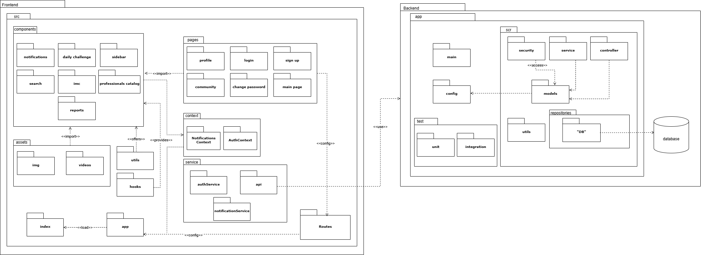
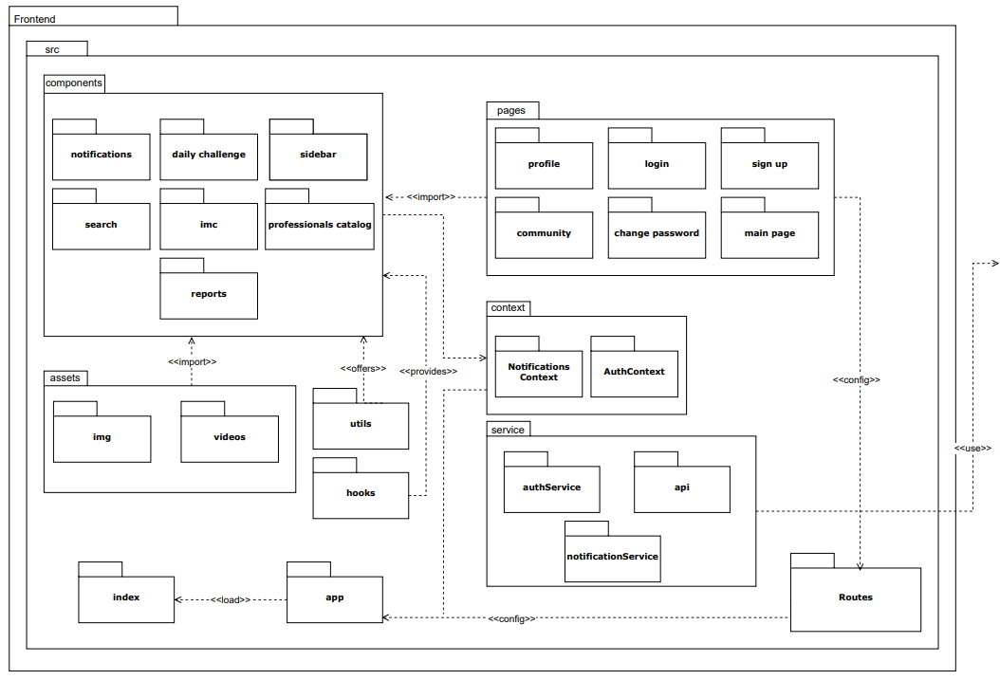
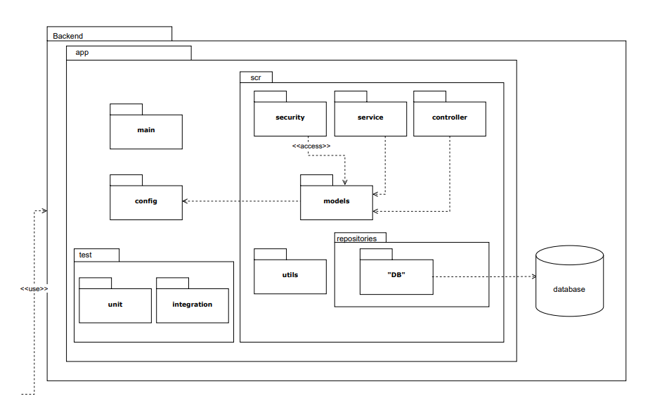

# __Diagrama de Pacotes__

## __Introdução__

Este documento apresenta o diagrama de pacotes do projeto EuMeAmo, uma plataforma desenvolvida com foco no bem-estar, desafios diários e interação social. O sistema foi projetado para oferecer uma experiência intuitiva e modular tanto no front-end quanto no back-end. O diagrama de pacotes aqui descrito visa documentar a estrutura do projeto, destacando os principais módulos e suas responsabilidades, além da metodologia adotada na organização do software.

## __Metodologia__

A divisão em pacotes foi realizada com base na arquitetura em camadas da aplicação, contemplando tanto a estrutura do front-end quanto do back-end. Cada pacote representa uma responsabilidade específica, agrupando arquivos relacionados por função, o que favorece a escalabilidade, a manutenibilidade e o reuso de componentes. A modularização foi pensada para facilitar a colaboração da equipe, os testes automatizados e a integração contínua. Para a criação do diagrama, foi utilizada a ferramenta Draw.io, que possibilitou a modelagem visual de forma prática e colaborativa, facilitando o entendimento da estrutura do sistema por toda a equipe.

## __Tabela de Participação na Produção do Artefato__

| 
Nome do Integrante | 
Artefato | 
Descrição da Contribuição | 
Análise Crítica* | 
Link Comprobatório |
|------------|----------|------------|------------|---------|
|  [Fillipe Adrade]()| Diagrama de Pacotes | "Eu Participei ativamente da criação do diagrama de Pacotes e auxiliando na modelagem e fui responsavel pela criação da documentação completa do artefato no repositório. "| "Fazer o diagrama de pacotes me ajudou a entender melhor como a estrutura do projeto influencia na organização do código. Ao separar o sistema em pacotes, percebi como isso facilita a manutenção, a reutilização de componentes e a divisão de tarefas entre a equipe. Antes eu não dava tanta atenção pra isso, mas agora vejo que pensar bem nessa divisão desde o início deixa o desenvolvimento mais claro e eficiente, além de evitar bagunça conforme o projeto cresce." | [Ata 02](../Projeto/IniciativasExtras/ata_02.md) |
|  [Arthur Fonseca ]()| Diagrama de Pacotes | "Participei ativamente da modelagem e agrupamento dos módulos do sistema em pacotes lógicos. Defini os principais namespaces (frontend e backend), organizei os componentes React, contextos, serviços e repositórios em pacotes coerentes. "| "Ao trabalhar na construção do diagrama de pacotes, tive que refletir sobre como o sistema realmente está organizado no projeto. No início, foi um pouco desafiador entender como dividir corretamente as partes do backend e do frontend, mas conforme fui montando, ficou claro como essa separação ajuda a visualizar melhor a estrutura geral. Percebi que, além de facilitar o entendimento do sistema, o diagrama também ajuda a identificar possíveis melhorias na organização do código. Com isso, concluí que criar esse tipo de diagrama não é só uma etapa de documentação, mas uma ferramenta útil para pensar a arquitetura de forma mais clara e lógica." | [Ata 02](../Projeto/IniciativasExtras/ata_02.md) |
|  [Letícia Hladczuk]()| Diagrama de Pacotes | "Eu Participei Na modelagem do diagrama de pacotes, contribuí com a definição da estrutura modular do sistema. "| "O trabalho com o diagrama de pacotes me fez refletir sobre a importância da organização estrutural do sistema desde o início. Essa modelagem facilita a escalabilidade e a compreensão do projeto como um todo, especialmente em times maiores. Aprendi que boas práticas de modularização ajudam não só no desenvolvimento, mas também na reutilização e teste dos componentes. Além disso, visualizar as dependências deixou mais claro onde poderiam surgir problemas de acoplamento excessivo." | [Ata 02](../Projeto/IniciativasExtras/ata_02.md)  |

## O Diagrama de Pacotes

Inicialmente, discutimos sobre como seria a estrutura do projeto e decidimos fazer a modelagem seguindo a estrutura base dos projetos das tecnologias que serão utilizadas no desenvolvimento. Assim, desenvolveu-se o diagrama da figura 1.

Figura 1: Diagrama de Pacotes EuMeAmo.

__Autor(es):__ [Arthur Fonseca](), [Fillipe Andrade]() e [Letícia Hladczuk]() .

## __Resultados__

### Frontend  
Os principais pacotes definidos para o front-end são:

- **components/**: Contém elementos reutilizáveis da interface, como menus, notificações, desafios diários, entre outros.
- **pages/**: Representa as páginas principais da aplicação, como `loginSignUp`, `mainPage`, `profile`, `community` e `changePassword`.
- **services/**: Responsável por interações com APIs, como autenticação e notificações.
- **context/**: Gerencia estados globais da aplicação, como autenticação (`AuthContext`) e notificações.
- **hooks/**: Abriga hooks personalizados reutilizáveis, promovendo a separação de lógica de controle.
- **routes/**: Define as rotas de navegação entre as páginas.
- **assets/**: Armazena recursos estáticos como imagens e vídeos.
- **utils/**: Contém funções auxiliares comuns a diferentes partes do sistema.
- **AppIndex/**: Ponto de entrada da aplicação, onde a estrutura principal é montada.

Figura 2: Diagrama de Pacotes FrontEnd.

__Autor(es):__ [Arthur Fonseca](), [Fillipe Andrade]() e [Letícia Hladczuk]() .

### Backend  
O backend também segue uma estrutura modular e clara, com os seguintes pacotes:

- **controller/**: Camada responsável por receber requisições, validar dados e direcionar o fluxo para a camada de serviço.
- **service/**: Implementa as regras de negócio da aplicação.
- **repositories/**: Responsável pela persistência e recuperação de dados no banco.
- **models/**: Define as entidades que representam as tabelas e objetos do domínio.
- **security/**: Gerencia autenticação, autorização e segurança da aplicação.
- **config/**: Contém as configurações globais da aplicação.
- **utils/**: Inclui ferramentas e funções auxiliares.
- **database/**: Scripts ou módulos relacionados ao banco de dados.
- **test/**: Dividido entre testes unitários e de integração, garantindo a qualidade do código.

Figura 3: Diagrama de Pacotes BackEnd.

__Autor(es):__ [Arthur Fonseca](), [Fillipe Andrade]() e [Letícia Hladczuk]() .

## Justificativa da Estrutura  
A separação clara entre camadas e pacotes foi essencial para garantir uma organização eficiente do sistema. A reutilização de componentes, centralização de estados globais e modularização de serviços tornam o desenvolvimento mais ágil e o código mais legível. A divisão entre front-end e back-end também facilita o trabalho em equipe e o versionamento independente das interfaces e da lógica de negócio.

## __Gravação da Produção do Artefato__

<iframe width="560" height="315" src="https://www.youtube.com/embed/yYt5kwXYNW0" 
title="YouTube video player" frameborder="0" 
allow="accelerometer; autoplay; clipboard-write; encrypted-media; gyroscope; picture-in-picture; web-share" 
allowfullscreen></iframe>

## Conclusão  
A construção e análise do diagrama de pacotes proporcionaram uma visão sistêmica da aplicação, permitindo mapear com clareza os pontos de conexão entre módulos e identificar oportunidades de melhoria estrutural. A abordagem adotada pela equipe no projeto **EuMeAmo** favorece práticas de desenvolvimento modernas e sustentáveis, com foco em escalabilidade, organização e coesão entre os componentes.

## __Referências Bibliográficas__

> 1. UML Package Diagrams Overview. Disponível em: [https://www.uml-diagrams.org/package-diagrams-overview.html](https://www.uml-diagrams.org/package-diagrams-overview.html). Acesso em: 29 de maio. de 2025.
>
> 4. IMPORTÂNCIA DO DIAGRAMA DE PACOTES PARA O DESENVOLVIMENTO DE SOFTWARE. Disponível em: [https://www4.fag.edu.br/anais-2022/Anais-2022-106.pdf](https://www4.fag.edu.br/anais-2022/Anais-2022-106.pdf). Acesso em 29 de maio. de 2025.
>

## __Histórico de versões__

| Versão | Data | Descrição | Autor | Revisor |
|--------|------|-----------|-------|---------|
| '1.0'  | 02/05/2025 | Criação da Documentação do Diagrama de Pacotes | [Fillipe]() | [Luiza e Letícia]()|
| '1.1'  | 02/05/2025 | Atualização da Documentação do Diagrama de Pacotes | [Fillipe]() | [Luiza e Letícia]()| 