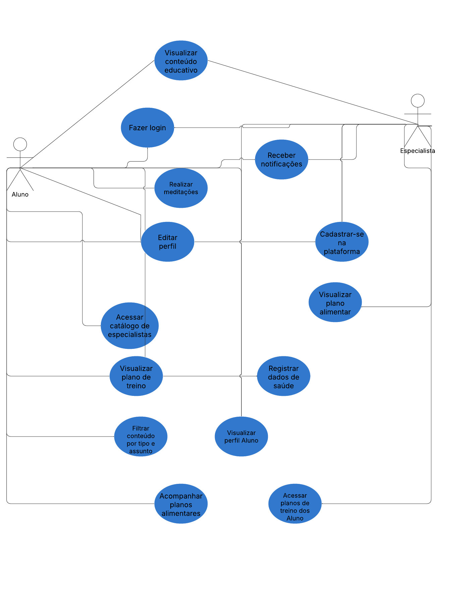
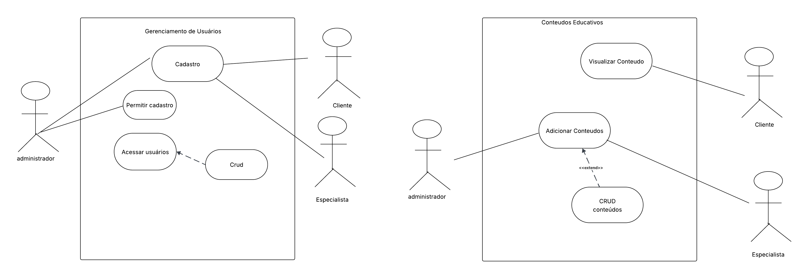
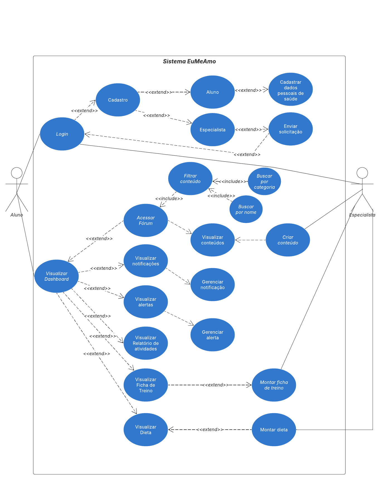

# **Diagrama de Caso de Uso**

## **Introdução**

Este documento tem como objetivo apresentar o Diagrama de Casos de Uso referente ao projeto EuMeAmo, desenvolvido na disciplina de Arquitetura e Desenho de SOftware. O diagrama visa descrever as funcionalidades do sistema sob a perspectiva dos usuários, permitindo uma visão geral dos serviços oferecidos pelo sistema e da interação entre os atores e os casos de uso.

## **Metodologia**

O Diagrama de Casos de Uso é uma técnica da UML (Unified Modeling Language) utilizada para representar graficamente as funcionalidades esperadas de um sistema e a interação dos usuários com essas funcionalidades. Segundo Pressman (2016), ele serve como base para a modelagem dos requisitos funcionais do sistema. A produção do diagrama foi feita com base nos requisitos levantados a partir das técnicas de elicitação, como brainstorming, questionário e análise de concorrência.

A construção do artefato seguiu os padrões definidos por Sommerville (2011), utilizando notações da UML 2.5 para representar atores, casos de uso e relacionamentos. A ferramenta Lucidchart foi utilizada para elaboração do diagrama. Os atores foram identificados com base nos perfis de usuários definidos no levantamento de requisitos, e os casos de uso foram extraídos das funcionalidades priorizadas na Matriz MoSCoW.

Uma vez que o grupo foi dividido em células para a produção da entrega 2, as células 1 e 3 ficaram responsáveis pela produção de diferentes perspectivas de diagramas de caso de uso. Nesse sentido, foram produzido 3 diagramas que serão apresentados a seguir.

## **Tabela de Participação na Produção do Artefato**

| 
Nome do Integrante                       | 
Artefato        | 
Descrição da Contribuição  | 
Análise Crítica\*                                                                                                                                                                                                 | 
Link Comprobatório                              |
| --------------------------------------------------- | ----------------------- | ------------------------------------- | ------------------------------------------------------------------------------------------------------------------------------------------------------------------------------------------------------------------------- | ------------------------------------------------------- |
| [Carlos Henrique](https://github.com/carlinn1)      | Diagrama de Caso de Uso | Participou da produção do diagrama 1. | -                                                                                                                                                                                                                         |                                                         |
| [Pablo Serra](https://github.com/Pabloserrapxx)     | Diagrama de Caso de Uso | Participou da produção do diagrama 1. | Aprender com um diagrama de caso de uso ajuda a visualizar de forma clara quais funcionalidades o sistema oferece e quem interage com elas. Com base no artefato produzido pelo grupo, percebo que esse tipo de diagrama é fundamental para oferecer uma visualização clara das principais funcionalidades do sistema e de como os diferentes usuários (Aluno e Especialista) interagem com ele.                                                                                                                                        |                                                         |
| [Rodrigo Fonseca](https://github.com/rodfon3301)    | Diagrama de Caso de Uso | Participou da produção do diagrama 1. | -                                                                                                                                                                                                                         |                                                         |
| [Gabriel Saraiva](https://github.com/gabrielsarcan) | Diagrama de Caso de Uso | Participou da produção do diagrama 2. | -                                                                                                                                                                                                                         | [Ata 5](../Projeto/IniciativasExtras/ata_05.md)         |
| [Mateus Levy](https://github.com/mateus9levy)       | Diagrama de Caso de Uso | Participou da produção do diagrama 2. | -                                                                                                                                                                                                                         | [Ata 5](../Projeto/IniciativasExtras/ata_05.md)         |
| [LucasBottino](https://github.com/bottinolucas)     | Diagrama de Caso de Uso | Participou da produção do diagrama 3. | -                                                                                                                                                                                                                         | [Gravação](https://www.youtube.com/watch?v=Es0skSnM9ms) |
| [Luiza Maluf](https://github.com/LuizaMaluf)        | Diagrama de Caso de Uso | Participou da produção do diagrama 3. | Após a análise dos outros diagramas de caso de uso desenvolvidos pelos outros integrantes do grupo, decidimos fazer um diagrama mais completo com todos aspectos definidos no escopo mínimo focando no usuário principal. | [Gravação](https://www.youtube.com/watch?v=Es0skSnM9ms) |
| [Lucas Bottino](https://github.com/bottinolucas)    | Diagrama de Caso de Uso | Participou da produção do diagrama 3. | Após a análise dos outros diagramas de caso de uso desenvolvidos pelos outros integrantes do grupo, decidimos fazer um diagrama mais completo com todos aspectos definidos no escopo mínimo focando no usuário principal. | [Gravação](https://www.youtube.com/watch?v=Es0skSnM9ms) |

## **Resultados**

### **Diagrama 1**

A seguir apresentamos o diagrama de caso de uso produzido pela célula 1, composta por [Carlos Henrique de Souza Bispo](https://github.com/carlinn1), [Pablo Serra Carvalho](https://github.com/Pabloserrapxx) e [Rodrigo Fonseca Rodrigues](https://github.com/rodfon3301).

### **Diagrama 2**

Em seguida, apresentamos o diagrama de caso de uso produzido pro dois integrantes da célula 3, sendo eles: [Gabriel Saraiva Canabrava](https://github.com/gabrielsarcan) e [Mateus Levy Avelans Boquady](https://github.com/mateus9levy).

### **Diagrama 3**

Por fim, apresentamos o diagrama de caso de uso produzido pelos dois outros integrantes da célula 3, dendo eles: [Lucas Gama De Araujo Bottino](https://github.com/bottinolucas) e [Luiza Maluf Amorim](https://github.com/LuizaMaluf).

## **Gravação da Produção do Artefato**

### **Diagrama 1:**

[Pendente]

### **Diagrama 2:**

<iframe width="560" height="315" src="https://www.youtube.com/embed/jAlEcjAqHGM?si=NizRiWP8tw_Fp3Q4" title="YouTube video player" frameborder="0" allow="accelerometer; autoplay; clipboard-write; encrypted-media; gyroscope; picture-in-picture; web-share" referrerpolicy="strict-origin-when-cross-origin" allowfullscreen></iframe>

### **Diagrama 3:**

<iframe width="560" height="315" src="https://www.youtube.com/embed/Es0skSnM9ms?si=F3-Y6rblg2qC311v" title="YouTube video player" frameborder="0" allow="accelerometer; autoplay; clipboard-write; encrypted-media; gyroscope; picture-in-picture; web-share" referrerpolicy="strict-origin-when-cross-origin" allowfullscreen></iframe>

## **Rastreabilidade**

Além de estar explícito a citação de outros artefatos (produzidos na Primeira entrega também) dentro dos textos, nessa seção deve ter uma lista com os links para os artefatos referenciados.

- [MoScoW](https://unbarqdsw2025-1-turma01.github.io/2025.1-T01-_G3_EuMeAmo_Entrega_01/#/Base/1.5.7.Priorizacao)
- [Escopo Mínimo](https://unbarqdsw2025-1-turma01.github.io/2025.1-T01-_G3_EuMeAmo_Entrega_01/#/Base/1.5.8.Escopo-minimo)

## **Referências Bibliográficas**

> PRESSMAN, R. S. Engenharia de Software. 8. ed. São Paulo: McGraw Hill Brasil, 2016.

> SOMMERVILLE, I. Engenharia de Software. 9. ed. São Paulo: Pearson Prentice Hall, 2011.

## **Histórico de versões**

| Versão | Data       | Descrição                                 | Autor                                               | Revisor                                                         |
| ------ | ---------- | ----------------------------------------- | --------------------------------------------------- | --------------------------------------------------------------- |
| '1.0'  | 09/05/2025 | Documentação do diagramas de caso de uso. | [Luiza Maluf Amorim](https://github.com/LuizaMaluf) | [Lucas Gama De Araujo Bottino](https://github.com/bottinolucas) |
